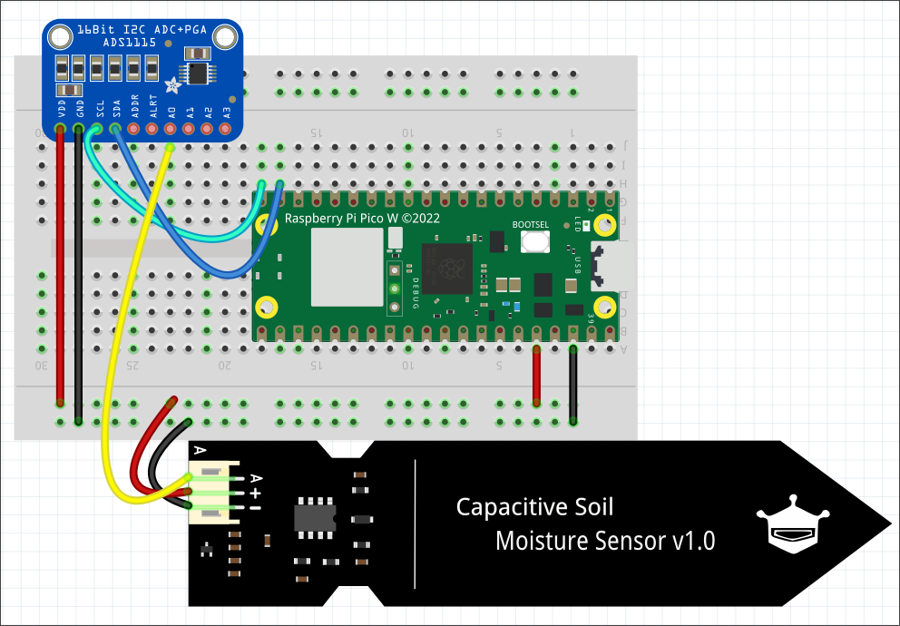

# Soil Moisture Sensor Station

This repository contains all the necessary code, files, and instructions to build a soil moisture sensor station. The station can host up to four capacitive soil moisture sensors and send their data to an MQTT broker.

## Table of Contents

1. [Integration](#integration)
    1. [Part List](#part-list)
    2. [Wiring](#wiring)
2. [Code](#code)
    1. [Overview](#overview)
    2. [Calibration](#calibration)
    3. [Configuration](#configuration)
    4. [Execution](#execution)
3. [Case](#case)
4. [To-Dos](#to-dos)

## Integration

### Part List

To build the soil moisture sensor station, you will need the following components:

- Raspberry Pi Pico W
- ADS1115 ADS Module
- Capacitive Soil Moisture Sensor(s) (CSM)
- Some wires

### Wiring

Connect the components as follows:

- Raspberry Pi Pico W:
  - Pin 38 (GND) to ground
  - Pin 36 (3V3) to power
  - Pin 19 (SDA) to SDA on ADS1115
  - Pin 20 (SCL) to SCL on ADS1115

- ADS1115 ADS Module:
  - Connect the sensor data pin (A) to one of the ADS1115 AIN pins (0 to 3)

## Code

### Overview

The code is organized into several files, each serving a specific purpose:

- `calibrate_sensor.py`: Calibrates the soil moisture sensors.
- `connection.py`: Contains functions for connecting to the MQTT broker.
- `flash.py`: Provides functions for controlling the onboard LED.
- `min_max_values.py`: Handles files from calibration.
- `read_ads115.py`: Contains functions to read values from the ADS1115.
- `run.py`: Main file for executing the sensor station.
- `umqttsimple.py`: MQTT module.
- `config.py`: Stores MQTT settings.
- `config_secrets.py`: Stores required secrets.

### Calibration

Before using the sensors, run `calibrate_sensor.py` to collect data in both dry and wet states. This sets the min and max values for accurate readings.

### Configuration

#### `config.py`

Set the following variables:
- `CLIENT_ID`
- `TOPIC_PUB`

#### `config_secrets.py`

Set the following variables:
- `SSID`
- `PASSWORD`
- `MQTT_USR`
- `MQTT_PW`
- `BROKER_IP`
- `BROKER_PORT`

### Execution

Rename `run.py` to `main.py` if you want it to run automatically after restart. Otherwise, start the script manually after each restart. Upon execution, the script performs the following steps:
1. Connects to Wi-Fi
2. Connects to the MQTT broker
3. Starts a loop to collect measurements and send messages to the broker

## Case

The case design is an early prototype available on [Onshape](https://cad.onshape.com/documents/518d248f6e5aea39b6ab69d1/w/3d88980ce4dfbb96793f4ee8/e/dbb9284e69cbf59d565ed000?renderMode=0&uiState=663a18495b30080d8716d2d1). It requires further optimization. The measurements of the components are correct, but the holes for the M2 screws and threaded inserts are oversized to accommodate printer tolerances.

Feel free to use and modify the case design according to your needs.

## To-Dos
- Secret Handling
- Config Handling
- Revisit Case
- Battery implementation

